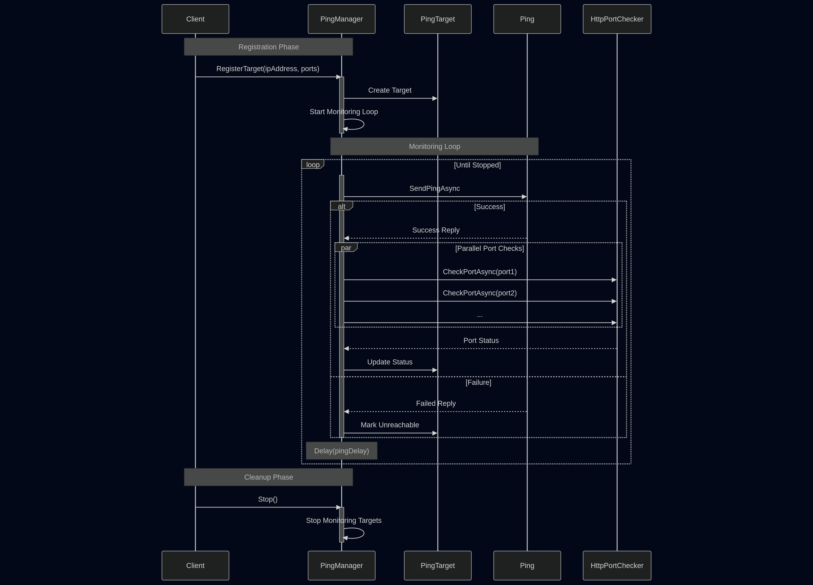
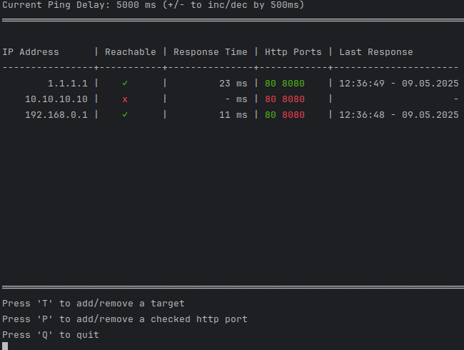

# Ping List Bot

This is an implementation of a ping list bot console application.
It allows to input ip addresses (targets) as a comma separated list and starts pinging them.
Additionally, for each reachable ip address, it checks for some http ports (80 and 8080 by default).

## Asynchronous Design

Targets are registered in the Ping Manager. 
After registering, the ping manager starts an asynchronous looping task that pings the target over and over. 
With a successful ping, the ping manager will then go on and check http ports for a target asynchronously.
When all ports checks are finished, the ping target is updated.
For unsuccessful pings, the ping manager does not check http ports and marks a target as unreachable.
In any case, an update request is sent to the console interface.
After producing the update request, the ping manager waits for a specified delay before the next ping cycle.

Adding a new checked http port adds a port check to a target that will be checked on the next ping cycle.
Adding a new target registers a new ip address as ping target and starts the asynchronous ping loop for it.

## Command Line Interface

Starts with a prompt to insert an initial comma-seperated list of ip addresses to ping.
Whenever an ip address is inserted it is checked for validity.

Then, the main interface is printed to the console and updated whenever it receives and update request from the ping manager.
The main interface is separated in three sections:
 - header:
   Shows the current ping delay, the minimum delay between two pings.
   The delay can be updated in steps of 500ms by pressing +/-.
   The delay is limited to at least 1000ms to avoid any form of potential DoS attacks.
 - footer:
   Shows other available commands in the console interface and potential warnings.
   It is possible to add new targets and checked ports via pressing 'T' (Target) and 'P' (Port).
   To remove a target/port, one has to type an existing target/port in the 'add' prompt.
   If the target/port is already in the list it gets removed and is no longer pinged.
   Targets and ports that are added are checked for validity.
   If invalid a warning is displayed.
 - content: 
   Shows a table of all pinged targets with some colored output for reachable targets/ports.
   Green indicates a target is reachable or a http port is open.
   Red indicates a target is not reachable or a http port is closed.

